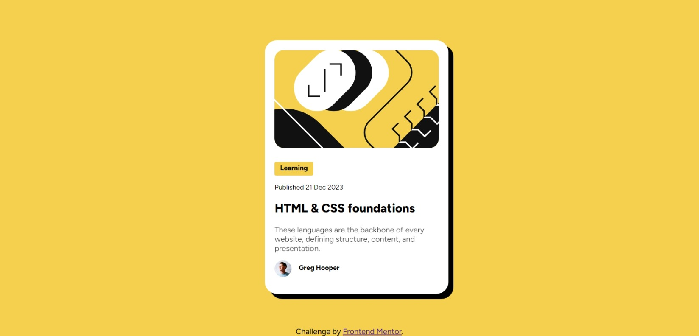

# Frontend Mentor - Blog preview card solution

This is a solution to the [Blog preview card challenge on Frontend Mentor](https://www.frontendmentor.io/challenges/blog-preview-card-ckPaj01IcS). Frontend Mentor challenges help you improve your coding skills by building realistic projects. 

## Table of contents

- [Overview](#overview)
  - [The challenge](#the-challenge)
  - [Screenshot](#screenshot)
  - [Links](#links)
- [My process](#my-process)
  - [Built with](#built-with)
  - [What I learned](#what-i-learned)
  - [Continued development](#continued-development)
  - [Useful resources](#useful-resources)
- [Author](#author)

## Overview

### The challenge

Users should be able to:

- See hover and focus states for all interactive elements on the page

### Screenshot

### Links

- Solution URL:https://www.frontendmentor.io/solutions/blog-preview-card-using-html-css-8nXi_5AZUD
- Live Site URL: https://anirudh1970.github.io/Blog-preview-card-Frontendmentor.io-/

## My process

### Built with

- Semantic HTML5 markup
- CSS custom properties
- Flexbox
- CSS Grid

### What I learned

How various CSS tags work and how to use them effectively to get the design we need.

### Continued development

Areas that need focussing for me:
1.Managing the arrangement of various divs.
2.Importing fonts.
3.Using JS.

### Useful resources

- [W3SCHOOLS](https://w3schools.com/) - Very useful and helped me in styling the page a lot.Definitely should check it out if you want to learn CSS.

## Author

- Frontend Mentor - [@anirudh1970](https://www.frontendmentor.io/profile/@anirudh1970)
